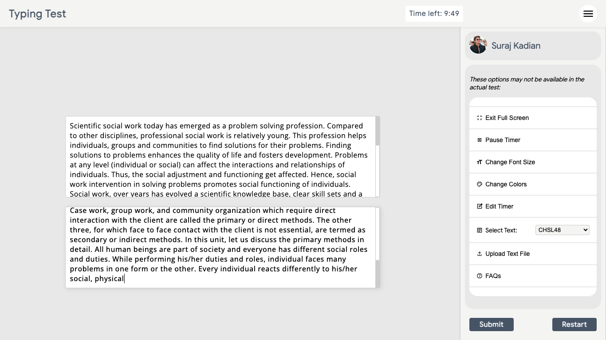
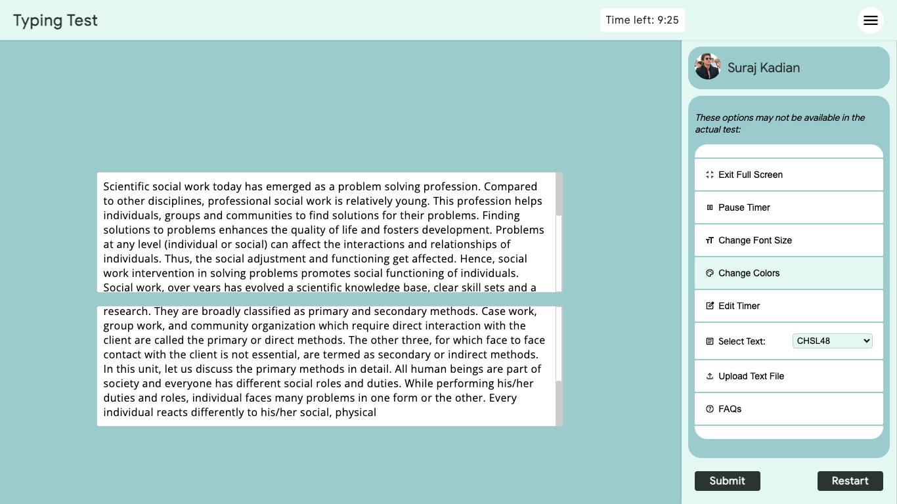
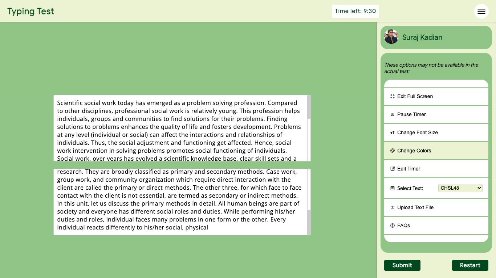
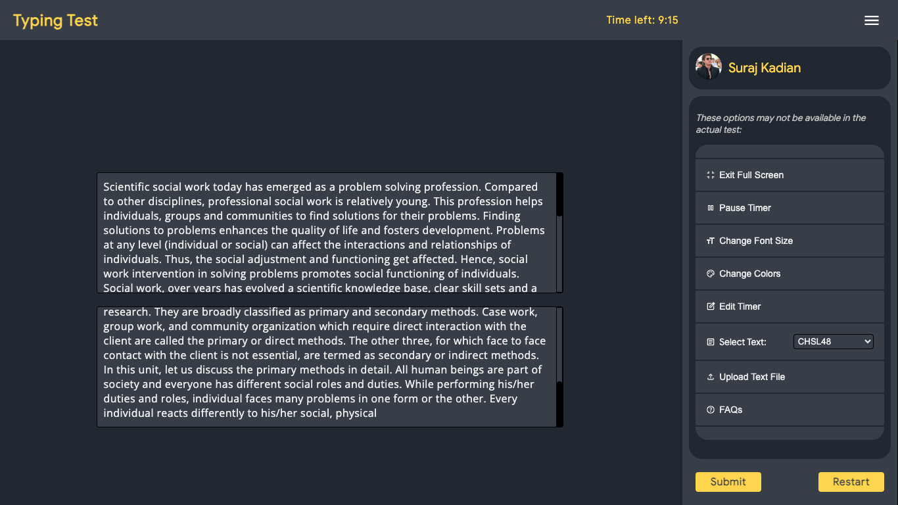

# Mock Typing Test

## 🖥 Screenshots

  
  
  

## 📖 Features 
- Minimal and straight forward interface
- Effective error calculation based on [SSC SCRIPT EVALUATION](https://ssc.gov.in/for-candidates/script-evaluation) including full mistakes and half mistakes.

- Layout similar to [that of SSC](https://www3.digialm.com//OnlineAssessment/index.html?164@@M510) with added functionalities 
- Basic typing features including: 
  - Typing speed
  - Word & Character counts
  - Timer
  - Error Highlighting
- And some basic customisations including:
  - Font Size customisation
  - Custom text (Option to upload text file or choose from pre-uploaded texts)
  - Custom timer
  - Multiple themes

## ⁉️ How to use?
- Easiest way: Visit [GitHub pages' website](https://surajkadian.github.io/TypingPractice/) and use.

- Another easy way: Download the [latest release](https://github.com/SurajKadian/TypingPractice/releases/latest) from the release section then unzip the downloaded files and open the `index.html` file with your browser.
